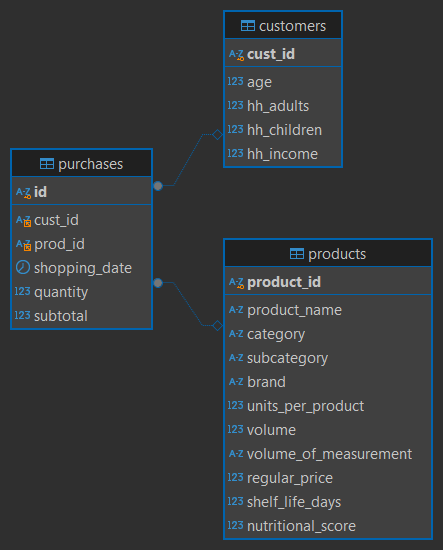

# H_Market SQL Analysis

## Overview
This project contains a complete SQL-based analysis of the `H_Market` database.  
The database includes three main tables:  

- **customers** → demographic details (age, household size, income)  
- **products** → product information (category, brand, nutritional score)  
- **purchases** → transaction data (date, quantity, revenue)  

The goal of this analysis is to uncover:  
- Data validation and quality checks  
- Customer segmentation by income  
- Top-performing product categories  
- Nutritional value trends  
- Basket size and daily revenue patterns  
- Premium product preferences for high-income customers  

This repository demonstrates how SQL can be used to deliver real business insights from raw data.

---

## Database Schema
The database schema consists of three related tables:

---

## Key Analyses & Results

### 1. Row Counts
| Table       | Rows  |
|-------------|-------|
| customers   | 50    |
| products    | 1,604 |
| purchases   | 497   |

Data successfully imported.

---

### 2. Income Segmentation
| Income Group  | Customers |
|---------------|-----------|
| Medium Income | 33        |
| High Income   | 17        |
| Low Income    | 0         |

**Insight:** The customer base is primarily medium-income (66%) with a significant high-income segment (34%).

---

### 3. Top 10 Categories by Revenue
| Category               | Revenue ($) |
|------------------------|-------------|
| Pantry Essentials      | 2,058.55    |
| Supplements            | 1,083.45    |
| Dairy & Eggs           | 801.77      |
| Snacks & Dips          | 788.19      |
| Beverages              | 768.32      |

**Insight:** Pantry staples dominate sales, while health-focused categories like Supplements also show strong performance.

---

### 4. Average Nutritional Score by Category
| Category       | Avg. Nutritional Score |
|----------------|------------------------|
| Produce        | 6.37                  |
| Beverages      | 4.83                  |
| Pantry         | 3.62                  |

**Insight:** High-revenue categories (pantry, snacks) have lower nutritional scores, showing a trade-off between health and convenience.

---

### 5. Average Basket Size
| Metric              | Value |
|---------------------|--------|
| Avg Basket Size     | 2.33   |

**Insight:** Customers purchase approximately 2 items per visit, creating an opportunity for cross-selling.

---

### 6. Daily Revenue Trend
**Insight:** Steady daily revenue with minor spikes indicates consistent purchasing behavior. Promotions could focus on weekends to capture peak shopping activity.

---

### 7. Top 5 Products for High-Income Customers
| Product                                     | Revenue ($) |
|--------------------------------------------|-------------|
| Organic Lemon Balm Alcohol Free            | 223.70      |
| Sport Protein Peanut Butter Tub            | 194.97      |
| Lacto Complete Dairy Digestion             | 161.94      |
| Beef Tenderloin Steak Filet Mignon         | 135.96      |
| Cookout Classic Plant-Based Burger Patties | 88.94       |

**Insight:** High-income customers prefer premium health and specialty products, making them a key target for high-margin campaigns.

---

## Business Takeaways
- Focus marketing on medium-income households for volume and high-income customers for premium upselling.
- Promote pantry essentials and supplements, which are strong revenue drivers.
- Launch bundle promotions to increase the average basket size.
- Target high-income customers with organic and premium product campaigns.
